# AI Agent Observatory — Tüm Diyagramlar
# Versiyon: 2.0 — Kod ile tam uyumlu

## Auth System Sequence Diagrams

### 1. Register Akışı

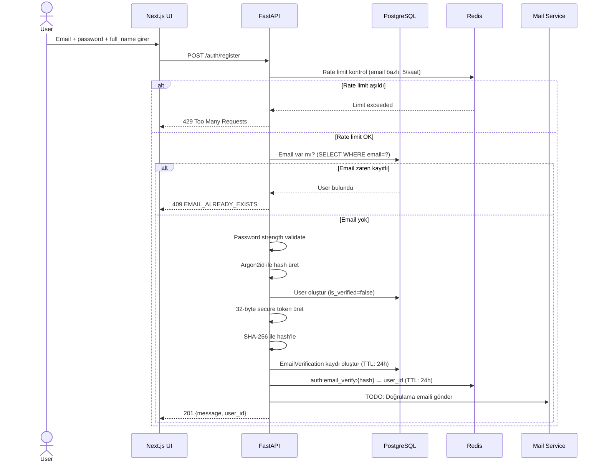
```mermaid
sequenceDiagram
    actor User
    participant UI as Next.js UI
    participant API as FastAPI
    participant DB as PostgreSQL
    participant Redis
    participant Mail as Mail Service

    User->>UI: Email + password + full_name girer
    UI->>API: POST /auth/register
    API->>Redis: Rate limit kontrol (email bazlı, 5/saat)
    alt Rate limit aşıldı
        Redis-->>API: Limit exceeded
        API-->>UI: 429 Too Many Requests
    else Rate limit OK
        API->>DB: Email var mı? (SELECT WHERE email=?)
        alt Email zaten kayıtlı
            DB-->>API: User bulundu
            API-->>UI: 409 EMAIL_ALREADY_EXISTS
        else Email yok
            API->>API: Password strength validate
            API->>API: Argon2id ile hash üret
            API->>DB: User oluştur (is_verified=false)
            API->>API: 32-byte secure token üret
            API->>API: SHA-256 ile hash'le
            API->>DB: EmailVerification kaydı oluştur (TTL: 24h)
            API->>Redis: auth:email_verify:{hash} → user_id (TTL: 24h)
            API->>Mail: TODO: Doğrulama emaili gönder
            API-->>UI: 201 {message, user_id}
        end
    end
```

---

### 2. Login Akışı

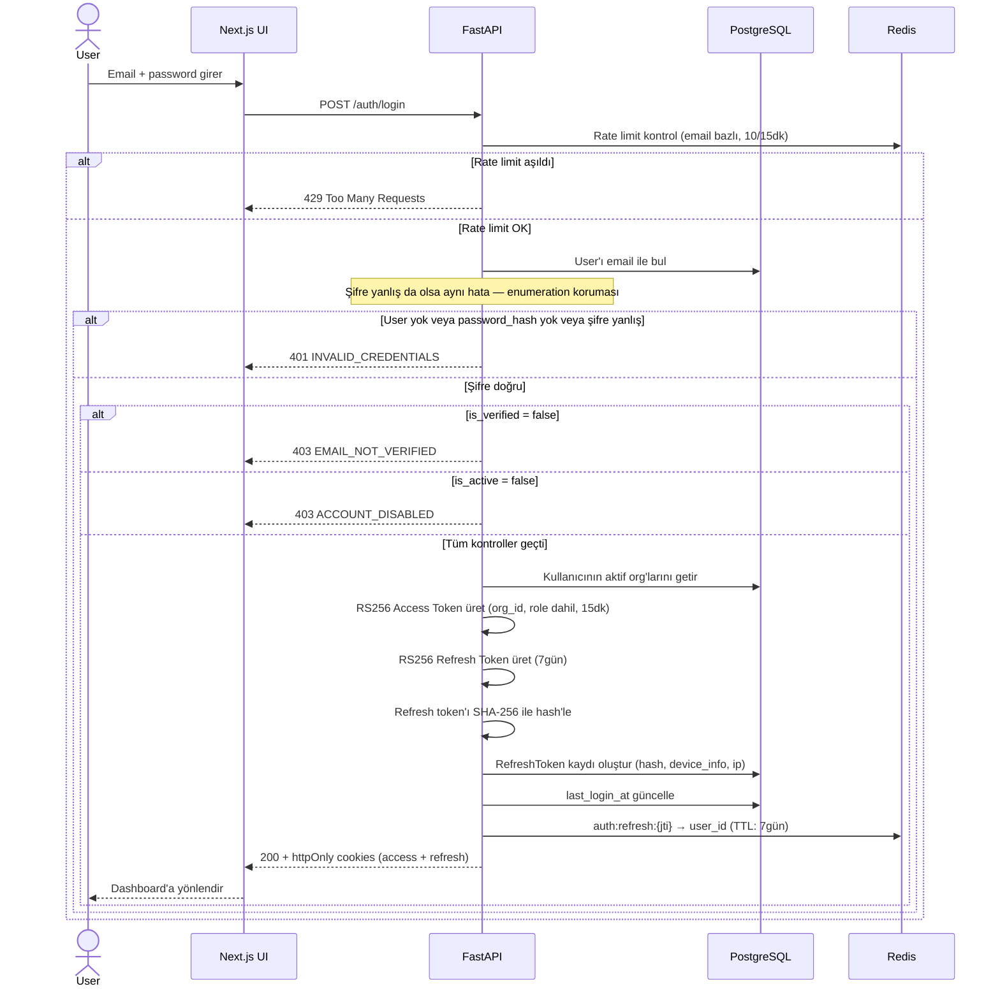
```mermaid
sequenceDiagram
    actor User
    participant UI as Next.js UI
    participant API as FastAPI
    participant DB as PostgreSQL
    participant Redis

    User->>UI: Email + password girer
    UI->>API: POST /auth/login
    API->>Redis: Rate limit kontrol (email bazlı, 10/15dk)
    alt Rate limit aşıldı
        API-->>UI: 429 Too Many Requests
    else Rate limit OK
        API->>DB: User'ı email ile bul
        Note over API: Şifre yanlış da olsa aynı hata — enumeration koruması
        alt User yok veya password_hash yok veya şifre yanlış
            API-->>UI: 401 INVALID_CREDENTIALS
        else Şifre doğru
            alt is_verified = false
                API-->>UI: 403 EMAIL_NOT_VERIFIED
            else is_active = false
                API-->>UI: 403 ACCOUNT_DISABLED
            else Tüm kontroller geçti
                API->>DB: Kullanıcının aktif org'larını getir
                API->>API: RS256 Access Token üret (org_id, role dahil, 15dk)
                API->>API: RS256 Refresh Token üret (7gün)
                API->>API: Refresh token'ı SHA-256 ile hash'le
                API->>DB: RefreshToken kaydı oluştur (hash, device_info, ip)
                API->>DB: last_login_at güncelle
                API->>Redis: auth:refresh:{jti} → user_id (TTL: 7gün)
                API-->>UI: 200 + httpOnly cookies (access + refresh)
                UI-->>User: Dashboard'a yönlendir
            end
        end
    end
```

---

### 3. Token Refresh Akışı (Token Rotation)

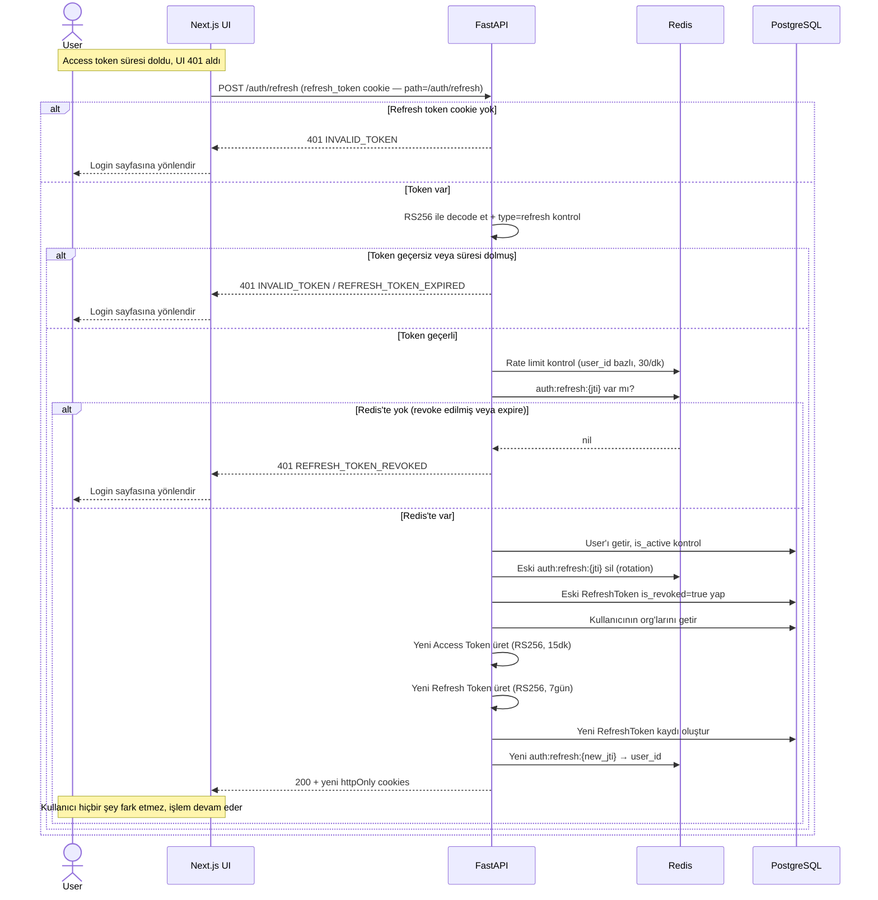
```mermaid
sequenceDiagram
    actor User
    participant UI as Next.js UI
    participant API as FastAPI
    participant Redis
    participant DB as PostgreSQL

    Note over User,UI: Access token süresi doldu, UI 401 aldı
    UI->>API: POST /auth/refresh (refresh_token cookie — path=/auth/refresh)
    alt Refresh token cookie yok
        API-->>UI: 401 INVALID_TOKEN
        UI-->>User: Login sayfasına yönlendir
    else Token var
        API->>API: RS256 ile decode et + type=refresh kontrol
        alt Token geçersiz veya süresi dolmuş
            API-->>UI: 401 INVALID_TOKEN / REFRESH_TOKEN_EXPIRED
            UI-->>User: Login sayfasına yönlendir
        else Token geçerli
            API->>Redis: Rate limit kontrol (user_id bazlı, 30/dk)
            API->>Redis: auth:refresh:{jti} var mı?
            alt Redis'te yok (revoke edilmiş veya expire)
                Redis-->>API: nil
                API-->>UI: 401 REFRESH_TOKEN_REVOKED
                UI-->>User: Login sayfasına yönlendir
            else Redis'te var
                API->>DB: User'ı getir, is_active kontrol
                API->>Redis: Eski auth:refresh:{jti} sil (rotation)
                API->>DB: Eski RefreshToken is_revoked=true yap
                API->>DB: Kullanıcının org'larını getir
                API->>API: Yeni Access Token üret (RS256, 15dk)
                API->>API: Yeni Refresh Token üret (RS256, 7gün)
                API->>DB: Yeni RefreshToken kaydı oluştur
                API->>Redis: Yeni auth:refresh:{new_jti} → user_id
                API-->>UI: 200 + yeni httpOnly cookies
                Note over UI,User: Kullanıcı hiçbir şey fark etmez, işlem devam eder
            end
        end
    end
```

---

### 4. Logout Akışı

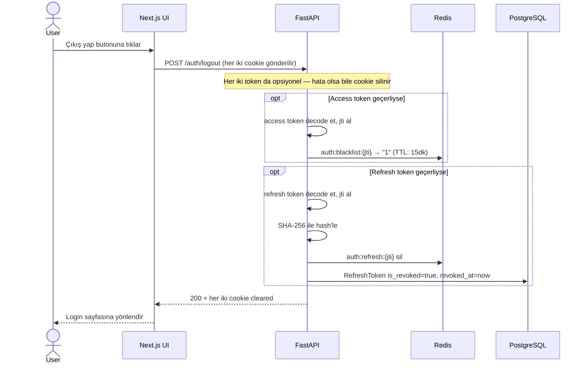
```mermaid
sequenceDiagram
    actor User
    participant UI as Next.js UI
    participant API as FastAPI
    participant Redis
    participant DB as PostgreSQL

    User->>UI: Çıkış yap butonuna tıklar
    UI->>API: POST /auth/logout (her iki cookie gönderilir)
    Note over API: Her iki token da opsiyonel — hata olsa bile cookie silinir
    opt Access token geçerliyse
        API->>API: access token decode et, jti al
        API->>Redis: auth:blacklist:{jti} → "1" (TTL: 15dk)
    end
    opt Refresh token geçerliyse
        API->>API: refresh token decode et, jti al
        API->>API: SHA-256 ile hash'le
        API->>Redis: auth:refresh:{jti} sil
        API->>DB: RefreshToken is_revoked=true, revoked_at=now
    end
    API-->>UI: 200 + her iki cookie cleared
    UI-->>User: Login sayfasına yönlendir
```

---

### 5. Protected Endpoint Akışı

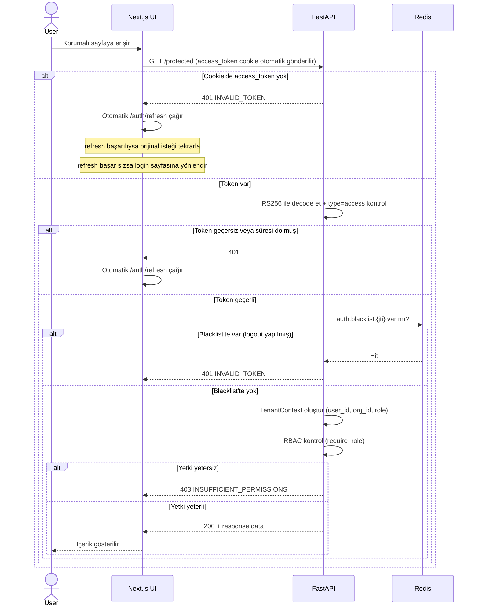
```mermaid
sequenceDiagram
    actor User
    participant UI as Next.js UI
    participant API as FastAPI
    participant Redis

    User->>UI: Korumalı sayfaya erişir
    UI->>API: GET /protected (access_token cookie otomatik gönderilir)
    alt Cookie'de access_token yok
        API-->>UI: 401 INVALID_TOKEN
        UI->>UI: Otomatik /auth/refresh çağır
        Note over UI: refresh başarılıysa orijinal isteği tekrarla
        Note over UI: refresh başarısızsa login sayfasına yönlendir
    else Token var
        API->>API: RS256 ile decode et + type=access kontrol
        alt Token geçersiz veya süresi dolmuş
            API-->>UI: 401
            UI->>UI: Otomatik /auth/refresh çağır
        else Token geçerli
            API->>Redis: auth:blacklist:{jti} var mı?
            alt Blacklist'te var (logout yapılmış)
                Redis-->>API: Hit
                API-->>UI: 401 INVALID_TOKEN
            else Blacklist'te yok
                API->>API: TenantContext oluştur (user_id, org_id, role)
                API->>API: RBAC kontrol (require_role)
                alt Yetki yetersiz
                    API-->>UI: 403 INSUFFICIENT_PERMISSIONS
                else Yetki yeterli
                    API-->>UI: 200 + response data
                    UI-->>User: İçerik gösterilir
                end
            end
        end
    end
```

---

### 6. Password Reset Akışı

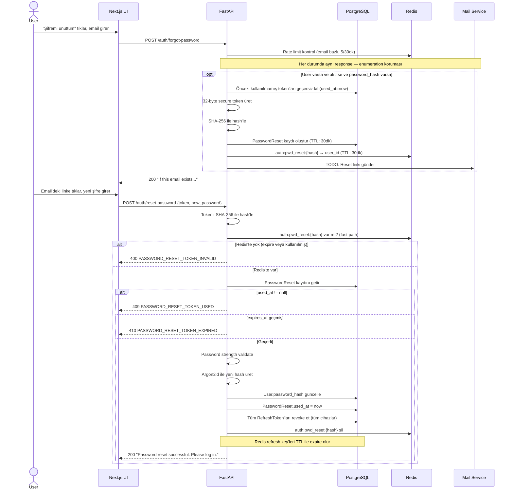
```mermaid
sequenceDiagram
    actor User
    participant UI as Next.js UI
    participant API as FastAPI
    participant DB as PostgreSQL
    participant Redis
    participant Mail as Mail Service

    User->>UI: "Şifremi unuttum" tıklar, email girer
    UI->>API: POST /auth/forgot-password
    API->>Redis: Rate limit kontrol (email bazlı, 5/30dk)
    Note over API,Mail: Her durumda aynı response — enumeration koruması
    opt User varsa ve aktifse ve password_hash varsa
        API->>DB: Önceki kullanılmamış token'ları geçersiz kıl (used_at=now)
        API->>API: 32-byte secure token üret
        API->>API: SHA-256 ile hash'le
        API->>DB: PasswordReset kaydı oluştur (TTL: 30dk)
        API->>Redis: auth:pwd_reset:{hash} → user_id (TTL: 30dk)
        API->>Mail: TODO: Reset linki gönder
    end
    API-->>UI: 200 "If this email exists..."

    User->>UI: Email'deki linke tıklar, yeni şifre girer
    UI->>API: POST /auth/reset-password {token, new_password}
    API->>API: Token'ı SHA-256 ile hash'le
    API->>Redis: auth:pwd_reset:{hash} var mı? (fast path)
    alt Redis'te yok (expire veya kullanılmış)
        API-->>UI: 400 PASSWORD_RESET_TOKEN_INVALID
    else Redis'te var
        API->>DB: PasswordReset kaydını getir
        alt used_at != null
            API-->>UI: 409 PASSWORD_RESET_TOKEN_USED
        else expires_at geçmiş
            API-->>UI: 410 PASSWORD_RESET_TOKEN_EXPIRED
        else Geçerli
            API->>API: Password strength validate
            API->>API: Argon2id ile yeni hash üret
            API->>DB: User.password_hash güncelle
            API->>DB: PasswordReset.used_at = now
            API->>DB: Tüm RefreshToken'ları revoke et (tüm cihazlar)
            API->>Redis: auth:pwd_reset:{hash} sil
            Note over API,DB: Redis refresh key'leri TTL ile expire olur
            API-->>UI: 200 "Password reset successful. Please log in."
        end
    end
```

---

### 7. Switch-Org Akışı

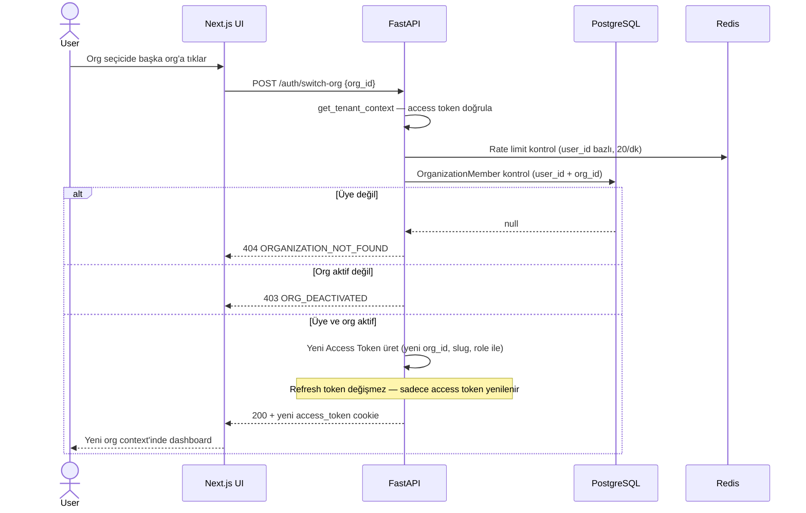
```mermaid
sequenceDiagram
    actor User
    participant UI as Next.js UI
    participant API as FastAPI
    participant DB as PostgreSQL
    participant Redis

    User->>UI: Org seçicide başka org'a tıklar
    UI->>API: POST /auth/switch-org {org_id}
    API->>API: get_tenant_context — access token doğrula
    API->>Redis: Rate limit kontrol (user_id bazlı, 20/dk)
    API->>DB: OrganizationMember kontrol (user_id + org_id)
    alt Üye değil
        DB-->>API: null
        API-->>UI: 404 ORGANIZATION_NOT_FOUND
    else Org aktif değil
        API-->>UI: 403 ORG_DEACTIVATED
    else Üye ve org aktif
        API->>API: Yeni Access Token üret (yeni org_id, slug, role ile)
        Note over API: Refresh token değişmez — sadece access token yenilenir
        API-->>UI: 200 + yeni access_token cookie
        UI-->>User: Yeni org context'inde dashboard
    end
```

---

## C4 Diyagramları

### C4 Level 1 — System Context

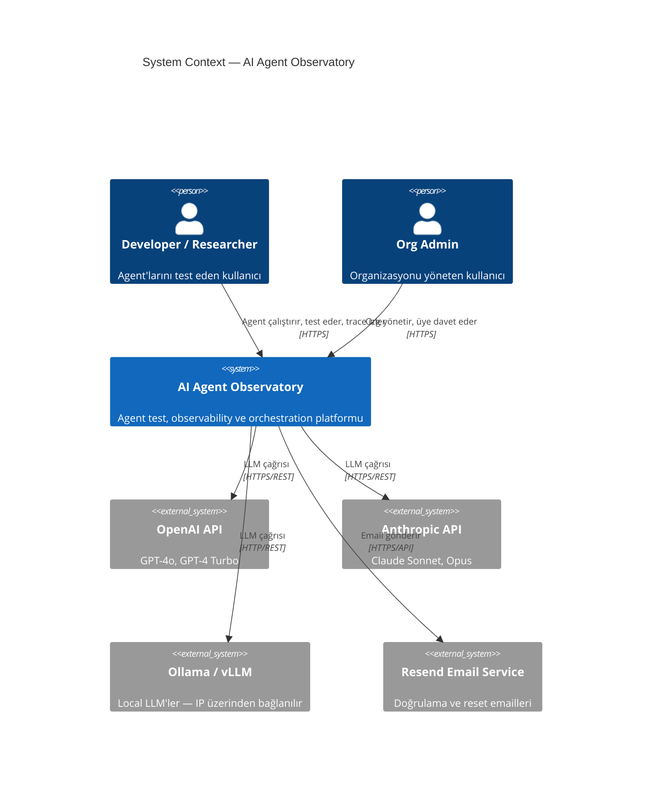
```mermaid
C4Context
    title System Context — AI Agent Observatory

    Person(user, "Developer / Researcher", "Agent'larını test eden kullanıcı")
    Person(orgAdmin, "Org Admin", "Organizasyonu yöneten kullanıcı")

    System(observatory, "AI Agent Observatory", "Agent test, observability ve orchestration platformu")

    System_Ext(openai, "OpenAI API", "GPT-4o, GPT-4 Turbo")
    System_Ext(anthropic, "Anthropic API", "Claude Sonnet, Opus")
    System_Ext(ollama, "Ollama / vLLM", "Local LLM'ler — IP üzerinden bağlanılır")
    System_Ext(email, "Resend Email Service", "Doğrulama ve reset emailleri")

    Rel(user, observatory, "Agent çalıştırır, test eder, trace izler", "HTTPS")
    Rel(orgAdmin, observatory, "Org yönetir, üye davet eder", "HTTPS")
    Rel(observatory, openai, "LLM çağrısı", "HTTPS/REST")
    Rel(observatory, anthropic, "LLM çağrısı", "HTTPS/REST")
    Rel(observatory, ollama, "LLM çağrısı", "HTTP/REST")
    Rel(observatory, email, "Email gönderir", "HTTPS/API")
```

---

### C4 Level 2 — Container

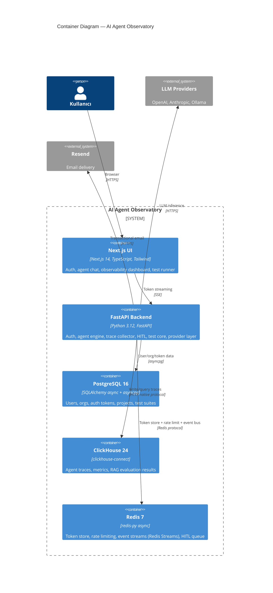
```mermaid
C4Container
    title Container Diagram — AI Agent Observatory

    Person(user, "Kullanıcı")

    System_Boundary(observatory, "AI Agent Observatory") {
        Container(ui, "Next.js UI", "Next.js 14, TypeScript, Tailwind", "Auth, agent chat, observability dashboard, test runner")
        Container(api, "FastAPI Backend", "Python 3.12, FastAPI", "Auth, agent engine, trace collector, HITL, test core, provider layer")
        Container(postgres, "PostgreSQL 16", "SQLAlchemy async + asyncpg", "Users, orgs, auth tokens, projects, test suites")
        Container(clickhouse, "ClickHouse 24", "clickhouse-connect", "Agent traces, metrics, RAG evaluation results")
        Container(redis, "Redis 7", "redis-py async", "Token store, rate limiting, event streams (Redis Streams), HITL queue")
    }

    System_Ext(llm, "LLM Providers", "OpenAI, Anthropic, Ollama")
    System_Ext(email, "Resend", "Email delivery")

    Rel(user, ui, "Browser", "HTTPS")
    Rel(ui, api, "REST API calls", "HTTPS/JSON")
    Rel(ui, api, "Event streaming", "WebSocket")
    Rel(ui, api, "Token streaming", "SSE")
    Rel(api, postgres, "User/org/token data", "asyncpg")
    Rel(api, clickhouse, "Write/query traces", "HTTP native protocol")
    Rel(api, redis, "Token store + rate limit + event bus", "Redis protocol")
    Rel(api, llm, "LLM inference", "HTTPS")
    Rel(api, email, "Transactional email", "HTTPS")
```

---

### C4 Level 3 — Component (FastAPI Backend)

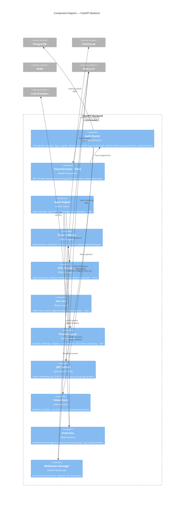
```mermaid
C4Component
    title Component Diagram — FastAPI Backend

    Container_Boundary(api, "FastAPI Backend") {
        Component(authRouter, "Auth Router", "FastAPI APIRouter", "10 endpoint: register, login, logout, refresh, me, switch-org, verify-email, resend-verify, forgot-password, reset-password")
        Component(tenantMiddleware, "TenantContext + RBAC", "FastAPI Dependency", "JWT decode, blacklist kontrol, org_id/role extraction, role-based access")
        Component(agentEngine, "Agent Engine", "Python async", "Agent lifecycle, tool calling, multi-agent orchestration — M9")
        Component(traceCollector, "Trace Collector", "Python async", "Redis Streams consumer, ClickHouse writer, WebSocket broadcaster")
        Component(hitlEngine, "HITL Engine", "Python async", "Approval queue, timeout management, Redis-based wait — M10")
        Component(testCore, "Test Core", "Python async", "YAML suite runner, AgentSandbox, RAG evaluator — M11")
        Component(providerLayer, "Provider Layer", "Python async", "OpenAI, Anthropic, Ollama — tek interface, SSE token streaming — M7")
        Component(jwtService, "JWT Service", "python-jose RS256", "Token create/decode, SHA-256 hash, secure token generation")
        Component(tokenStore, "Token Store", "redis-py async", "Whitelist, blacklist, rate limiting, email/pwd/invite tokens")
        Component(eventBus, "Event Bus", "Redis Streams", "Publish/consume agent events, consumer groups, org-scoped streams")
        Component(wsManager, "WebSocket Manager", "FastAPI WebSocket", "Per-trace subscriptions, org-level HITL broadcast")
    }

    Container_Ext(postgres, "PostgreSQL", "")
    Container_Ext(clickhouse, "ClickHouse", "")
    Container_Ext(redis, "Redis", "")
    Container_Ext(ui, "Next.js UI", "")
    Container_Ext(llm, "LLM Providers", "")

    Rel(ui, tenantMiddleware, "Her korumalı request", "HTTPS + cookie")
    Rel(tenantMiddleware, authRouter, "Auth endpoint'leri", "")
    Rel(authRouter, jwtService, "Token işlemleri", "")
    Rel(authRouter, tokenStore, "Redis token ops", "")
    Rel(authRouter, postgres, "User/org CRUD", "SQL")
    Rel(agentEngine, providerLayer, "LLM inference", "")
    Rel(agentEngine, eventBus, "Event publish", "Redis Streams")
    Rel(agentEngine, hitlEngine, "HITL checkpoint", "")
    Rel(eventBus, traceCollector, "Event consume", "Redis Streams")
    Rel(traceCollector, clickhouse, "Persist traces", "HTTP")
    Rel(traceCollector, wsManager, "Broadcast events", "")
    Rel(wsManager, ui, "Real-time events", "WebSocket")
    Rel(providerLayer, ui, "Token streaming", "SSE")
    Rel(providerLayer, llm, "LLM calls", "HTTPS")
```

---

## Flowchart Diyagramları

### 1. Agent Execution Flow

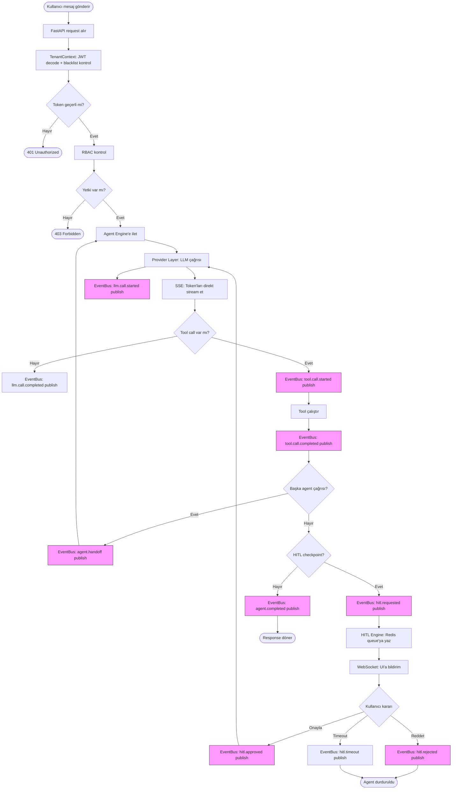
```mermaid
flowchart TD
    A([Kullanıcı mesaj gönderir]) --> B[FastAPI request alır]
    B --> C[TenantContext: JWT decode + blacklist kontrol]
    C --> D{Token geçerli mi?}
    D -- Hayır --> E([401 Unauthorized])
    D -- Evet --> F[RBAC kontrol]
    F --> G{Yetki var mı?}
    G -- Hayır --> H([403 Forbidden])
    G -- Evet --> I[Agent Engine'e ilet]
    I --> J[Provider Layer: LLM çağrısı]
    J --> K[SSE: Token'ları direkt stream et]
    J --> L[EventBus: llm.call.started publish]
    K --> M{Tool call var mı?}
    M -- Hayır --> N[EventBus: llm.call.completed publish]
    M -- Evet --> O[EventBus: tool.call.started publish]
    O --> P[Tool çalıştır]
    P --> Q[EventBus: tool.call.completed publish]
    Q --> R{Başka agent çağrısı?}
    R -- Evet --> S[EventBus: agent.handoff publish]
    S --> I
    R -- Hayır --> T{HITL checkpoint?}
    T -- Evet --> U[EventBus: hitl.requested publish]
    U --> V[HITL Engine: Redis queue'ya yaz]
    V --> W[WebSocket: UI'a bildirim]
    W --> X{Kullanıcı kararı}
    X -- Onayla --> Y[EventBus: hitl.approved publish]
    Y --> J
    X -- Reddet --> Z[EventBus: hitl.rejected publish]
    Z --> AA([Agent durduruldu])
    X -- Timeout --> AB[EventBus: hitl.timeout publish]
    AB --> AA
    T -- Hayır --> AC[EventBus: agent.completed publish]
    AC --> AD([Response döner])

    style L fill:#f9f,stroke:#333
    style O fill:#f9f,stroke:#333
    style Q fill:#f9f,stroke:#333
    style S fill:#f9f,stroke:#333
    style U fill:#f9f,stroke:#333
    style Y fill:#f9f,stroke:#333
    style Z fill:#f9f,stroke:#333
    style AC fill:#f9f,stroke:#333
```

---

### 2. EDA Event Flow (Redis Streams)

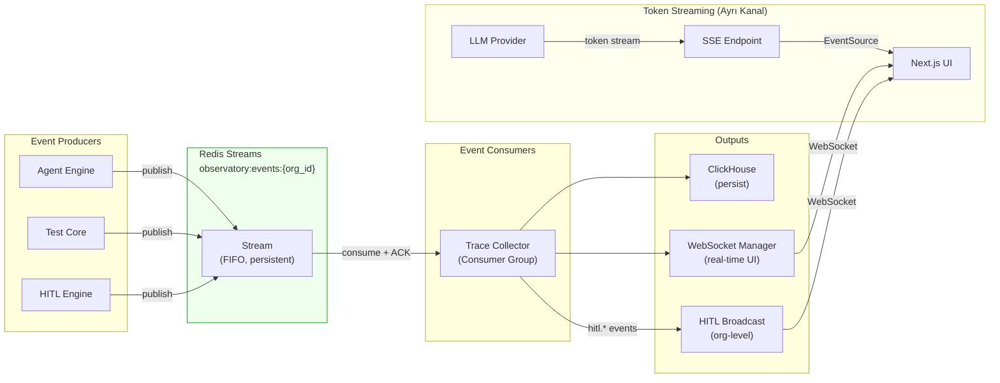
```mermaid
flowchart LR
    subgraph Producers["Event Producers"]
        AE["Agent Engine"]
        TE["Test Core"]
        HE["HITL Engine"]
    end

    subgraph Bus["Redis Streams\nobservatory:events:{org_id}"]
        S1["Stream\n(FIFO, persistent)"]
    end

    subgraph Consumers["Event Consumers"]
        TC["Trace Collector\n(Consumer Group)"]
    end

    subgraph Outputs["Outputs"]
        CH["ClickHouse\n(persist)"]
        WS["WebSocket Manager\n(real-time UI)"]
        HITL["HITL Broadcast\n(org-level)"]
    end

    subgraph SSE["Token Streaming (Ayrı Kanal)"]
        LLM["LLM Provider"] -->|"token stream"| SSEEP["SSE Endpoint"]
        SSEEP -->|"EventSource"| UI["Next.js UI"]
    end

    AE -->|publish| S1
    TE -->|publish| S1
    HE -->|publish| S1
    S1 -->|consume + ACK| TC
    TC --> CH
    TC --> WS
    TC -->|"hitl.* events"| HITL
    WS -->|"WebSocket"| UI
    HITL -->|"WebSocket"| UI

    style SSE fill:#ffe,stroke:#cc0
    style Bus fill:#efe,stroke:#090
```

---

### 3. Multi-Tenant İzolasyon

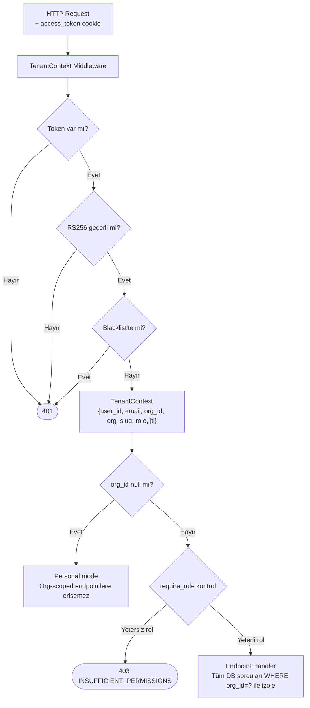
```mermaid
flowchart TD
    REQ["HTTP Request\n+ access_token cookie"] --> MW["TenantContext Middleware"]
    MW --> D1{Token var mı?}
    D1 -- Hayır --> E1([401])
    D1 -- Evet --> D2{RS256 geçerli mi?}
    D2 -- Hayır --> E1
    D2 -- Evet --> D3{Blacklist'te mi?}
    D3 -- Evet --> E1
    D3 -- Hayır --> CTX["TenantContext\n{user_id, email, org_id, org_slug, role, jti}"]
    CTX --> D4{org_id null mı?}
    D4 -- Evet --> PERSONAL["Personal mode\nOrg-scoped endpointlere erişemez"]
    D4 -- Hayır --> D5{require_role kontrol}
    D5 -- Yetersiz rol --> E2([403 INSUFFICIENT_PERMISSIONS])
    D5 -- Yeterli rol --> HANDLER["Endpoint Handler\nTüm DB sorguları WHERE org_id=? ile izole"]
```

---

### 4. HITL Flow

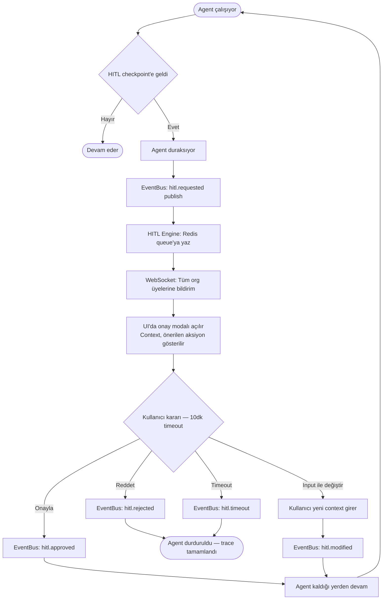
```mermaid
flowchart TD
    A([Agent çalışıyor]) --> B{HITL checkpoint'e geldi}
    B -- Hayır --> C([Devam eder])
    B -- Evet --> D[Agent duraksıyor]
    D --> E[EventBus: hitl.requested publish]
    E --> F[HITL Engine: Redis queue'ya yaz]
    F --> G[WebSocket: Tüm org üyelerine bildirim]
    G --> H[UI'da onay modalı açılır\nContext, önerilen aksiyon gösterilir]
    H --> I{Kullanıcı kararı — 10dk timeout}
    I -- Onayla --> J[EventBus: hitl.approved]
    J --> K[Agent kaldığı yerden devam]
    K --> A
    I -- Reddet --> L[EventBus: hitl.rejected]
    L --> M([Agent durduruldu — trace tamamlandı])
    I -- Input ile değiştir --> N[Kullanıcı yeni context girer]
    N --> O[EventBus: hitl.modified]
    O --> K
    I -- Timeout --> P[EventBus: hitl.timeout]
    P --> M
```

---

### 5. Test Runner Flow

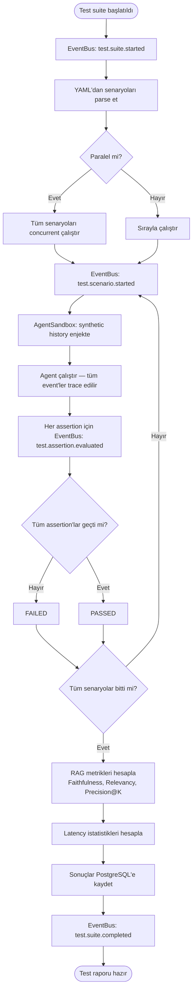
```mermaid
flowchart TD
    A([Test suite başlatıldı]) --> B[EventBus: test.suite.started]
    B --> C[YAML'dan senaryoları parse et]
    C --> D{Paralel mi?}
    D -- Evet --> E[Tüm senaryoları concurrent çalıştır]
    D -- Hayır --> F[Sırayla çalıştır]
    E & F --> G[EventBus: test.scenario.started]
    G --> H[AgentSandbox: synthetic history enjekte]
    H --> I[Agent çalıştır — tüm event'ler trace edilir]
    I --> J[Her assertion için EventBus: test.assertion.evaluated]
    J --> K{Tüm assertion'lar geçti mi?}
    K -- Hayır --> L[FAILED]
    K -- Evet --> M[PASSED]
    L & M --> N{Tüm senaryolar bitti mi?}
    N -- Hayır --> G
    N -- Evet --> O[RAG metrikleri hesapla\nFaithfulness, Relevancy, Precision@K]
    O --> P[Latency istatistikleri hesapla]
    P --> Q[Sonuçlar PostgreSQL'e kaydet]
    Q --> R[EventBus: test.suite.completed]
    R --> S([Test raporu hazır])
```

---

## ER Diyagramı

```mermaid
erDiagram
    users {
        UUID id PK
        VARCHAR email UK "Index var — login + davet lookup"
        VARCHAR password_hash "NULL = OAuth kullanıcısı (Faz 4)"
        BOOLEAN is_verified "false iken login yapılamaz"
        BOOLEAN is_active "false = soft delete, login engellenir"
        VARCHAR full_name
        VARCHAR avatar_url "NULL ise frontend initials gösterir"
        TIMESTAMPTZ last_login_at "Her başarılı login'de güncellenir"
        TIMESTAMPTZ created_at
        TIMESTAMPTZ updated_at
    }

    organizations {
        UUID id PK "JWT org_id claim'inde taşınır"
        VARCHAR name "Benzersiz olmak zorunda değil"
        VARCHAR slug UK "JWT org_slug claim'i — değiştirilemez"
        VARCHAR plan "free | pro | enterprise"
        BOOLEAN is_active "false ise tüm üyeler erişemez"
        UUID created_by FK "Owner otomatik organization_members'a eklenir"
        TIMESTAMPTZ created_at
        TIMESTAMPTZ updated_at
    }

    organization_members {
        UUID id PK
        UUID organization_id FK "CASCADE DELETE"
        UUID user_id FK "CASCADE DELETE"
        VARCHAR role "owner | admin | member — JWT role claim'i"
        TIMESTAMPTZ joined_at
    }

    refresh_tokens {
        UUID id PK
        UUID user_id FK "CASCADE DELETE"
        VARCHAR token_hash "SHA-256 — raw token saklanmaz"
        VARCHAR device_info "User-Agent — Faz 2 session listesi için"
        INET ip_address "Faz 5 security auditing için"
        TIMESTAMPTZ expires_at "7 gün"
        BOOLEAN is_revoked "Logout veya password reset'te true"
        TIMESTAMPTZ revoked_at
        TIMESTAMPTZ created_at
    }

    email_verifications {
        UUID id PK
        UUID user_id FK "CASCADE DELETE"
        VARCHAR token_hash "SHA-256"
        TIMESTAMPTZ expires_at "24 saat"
        TIMESTAMPTZ used_at "NULL = kullanılmadı — single-use enforcement"
        TIMESTAMPTZ created_at
    }

    password_resets {
        UUID id PK
        UUID user_id FK "CASCADE DELETE"
        VARCHAR token_hash "SHA-256 — Index var"
        TIMESTAMPTZ expires_at "30 dakika"
        TIMESTAMPTZ used_at "NULL = kullanılmadı — single-use enforcement"
        TIMESTAMPTZ created_at
    }

    organization_invitations {
        UUID id PK
        UUID organization_id FK "CASCADE DELETE"
        UUID invited_by FK "Kim davet etti — audit için"
        VARCHAR email "Davet edilen — login email ile eşleşmeli"
        VARCHAR role "admin | member — owner ile davet edilemez"
        VARCHAR token_hash "SHA-256 — Index var"
        VARCHAR status "pending | accepted | expired | cancelled"
        TIMESTAMPTZ expires_at "7 gün"
        TIMESTAMPTZ accepted_at
        TIMESTAMPTZ created_at
    }

    oauth_accounts {
        UUID id PK
        UUID user_id FK "CASCADE DELETE"
        VARCHAR provider "google | github"
        VARCHAR provider_id UK "provider + provider_id unique — çift bağlantı engeli"
        TEXT access_token "AES-256 şifreli (Faz 4)"
        TEXT refresh_token "AES-256 şifreli (Faz 4)"
        TIMESTAMPTZ expires_at
        TIMESTAMPTZ created_at
        TIMESTAMPTZ updated_at
    }

    users ||--o{ organization_members : "üye olur (birden fazla org)"
    users ||--o{ refresh_tokens : "sahip olur (birden fazla cihaz)"
    users ||--o{ email_verifications : "doğrulama token'ı alır"
    users ||--o{ password_resets : "reset token'ı alır"
    users ||--o{ oauth_accounts : "OAuth hesabı bağlar (Faz 4)"
    users ||--o{ organization_invitations : "davet gönderir"
    users ||--o{ organizations : "oluşturur (created_by)"
    organizations ||--o{ organization_members : "üye içerir"
    organizations ||--o{ organization_invitations : "davetleri vardır"
```

---

## M1 Diyagramları

### Servis Mimarisi

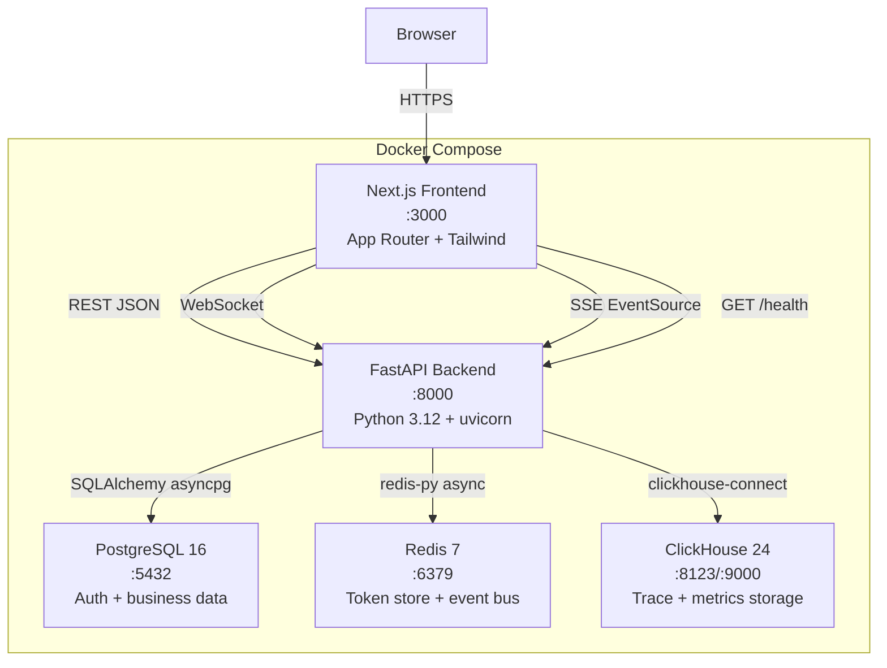
```mermaid
graph TB
    subgraph Docker["Docker Compose"]
        FE["Next.js Frontend\n:3000\nApp Router + Tailwind"]
        BE["FastAPI Backend\n:8000\nPython 3.12 + uvicorn"]
        PG["PostgreSQL 16\n:5432\nAuth + business data"]
        RD["Redis 7\n:6379\nToken store + event bus"]
        CH["ClickHouse 24\n:8123/:9000\nTrace + metrics storage"]
    end

    Browser["Browser"] -->|HTTPS| FE
    FE -->|REST JSON| BE
    FE -->|WebSocket| BE
    FE -->|SSE EventSource| BE
    BE -->|SQLAlchemy asyncpg| PG
    BE -->|redis-py async| RD
    BE -->|clickhouse-connect| CH
    FE -->|GET /health| BE
```

### Backend Başlatma Sırası (depends_on + healthcheck)

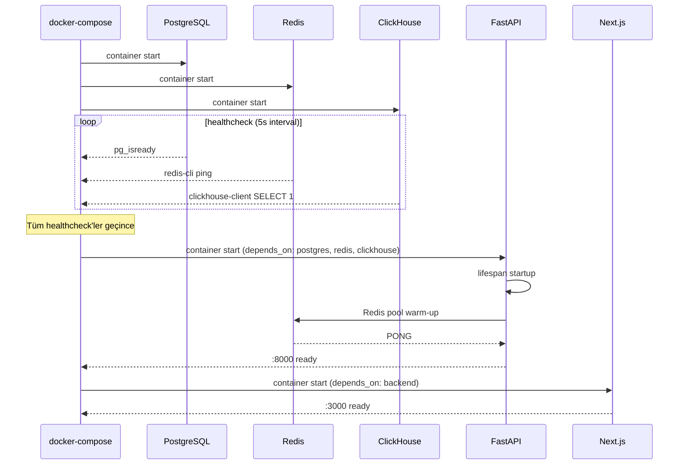
```mermaid
sequenceDiagram
    participant DC as docker-compose
    participant PG as PostgreSQL
    participant RD as Redis
    participant CH as ClickHouse
    participant BE as FastAPI
    participant FE as Next.js

    DC->>PG: container start
    DC->>RD: container start
    DC->>CH: container start
    loop healthcheck (5s interval)
        PG-->>DC: pg_isready
        RD-->>DC: redis-cli ping
        CH-->>DC: clickhouse-client SELECT 1
    end
    Note over DC: Tüm healthcheck'ler geçince
    DC->>BE: container start (depends_on: postgres, redis, clickhouse)
    BE->>BE: lifespan startup
    BE->>RD: Redis pool warm-up
    RD-->>BE: PONG
    BE-->>DC: :8000 ready
    DC->>FE: container start (depends_on: backend)
    FE-->>DC: :3000 ready
```

### Frontend → Backend Health Check

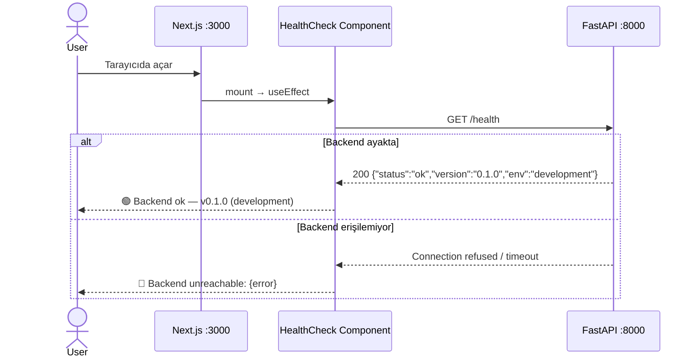
```mermaid
sequenceDiagram
    actor User
    participant FE as Next.js :3000
    participant HC as HealthCheck Component
    participant BE as FastAPI :8000

    User->>FE: Tarayıcıda açar
    FE->>HC: mount → useEffect
    HC->>BE: GET /health
    alt Backend ayakta
        BE-->>HC: 200 {"status":"ok","version":"0.1.0","env":"development"}
        HC-->>User: 🟢 Backend ok — v0.1.0 (development)
    else Backend erişilemiyor
        BE-->>HC: Connection refused / timeout
        HC-->>User: 🔴 Backend unreachable: {error}
    end
```
