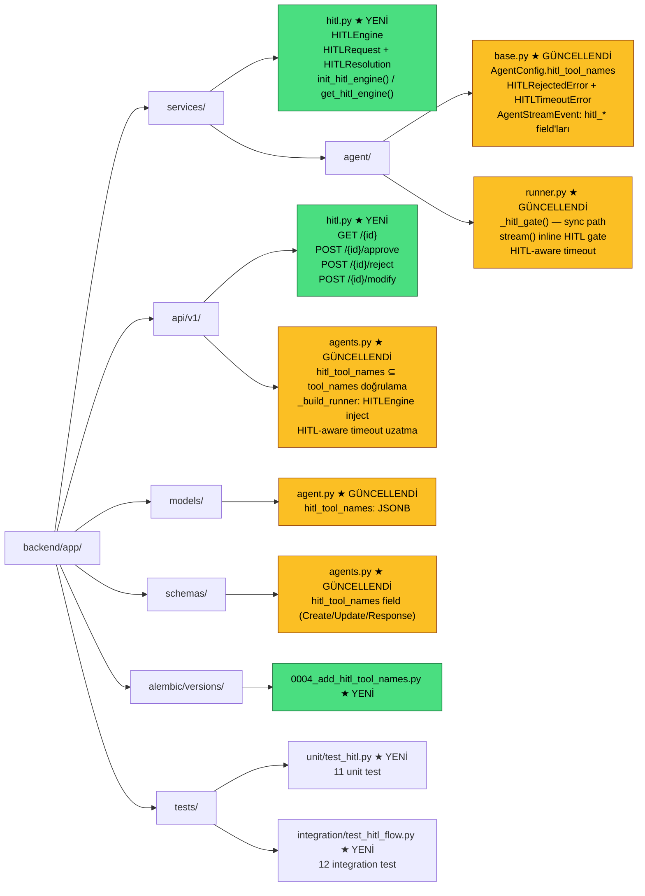
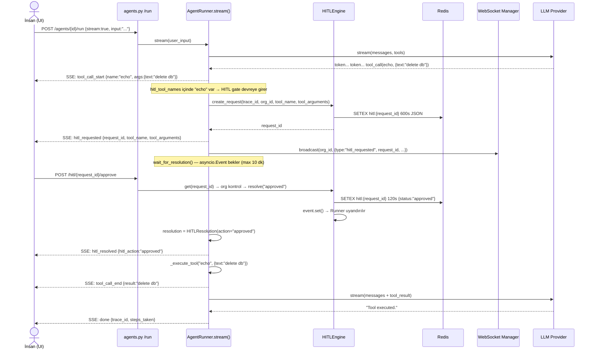
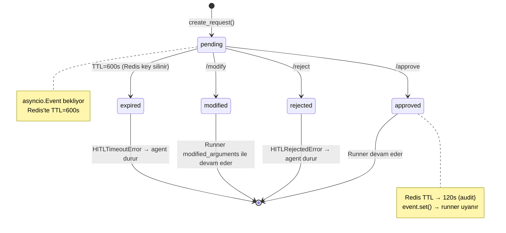
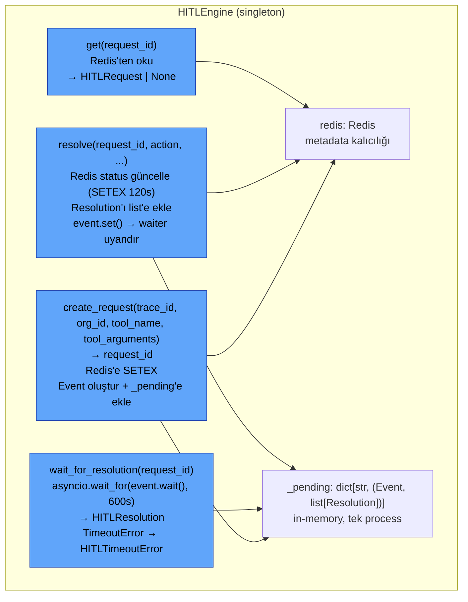
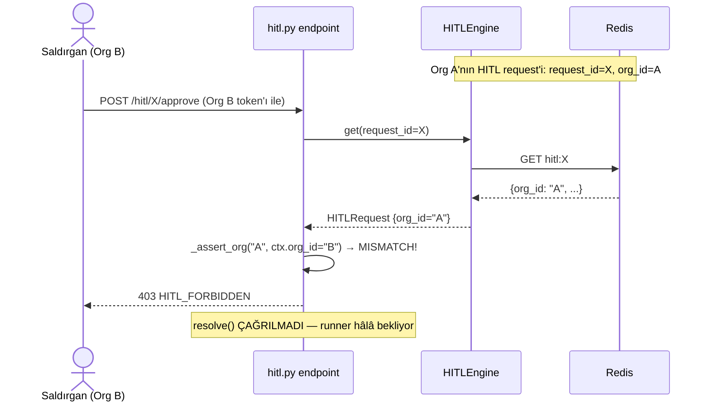
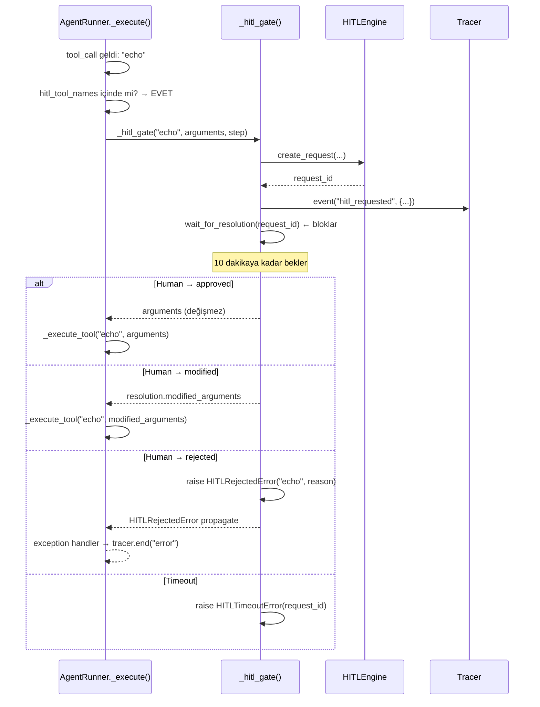
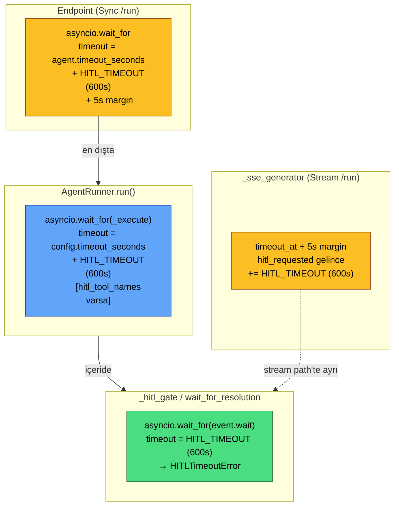
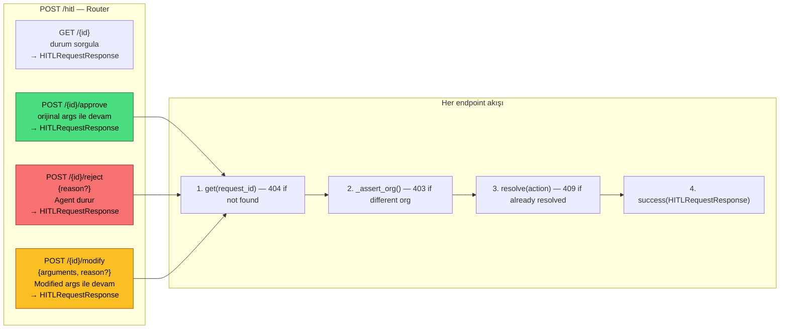
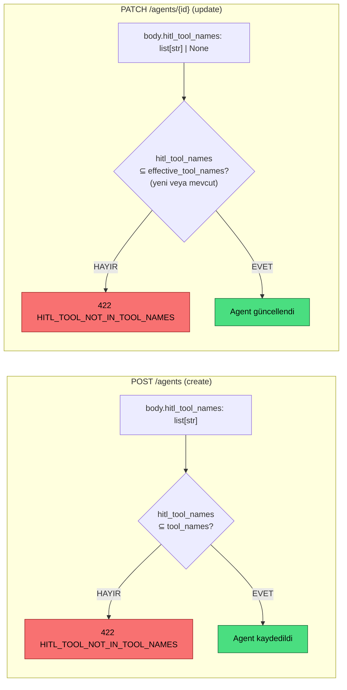
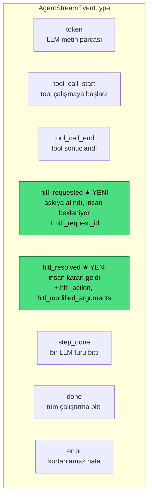

# M10 Diyagramları — HITL Engine

## 1. M10 Dosya Yapısı

---

## 2. HITL Tam Akışı (Stream Path)

---

## 3. HITL Durum Makinesi (State Machine)

---

## 4. HITLEngine İç Mimarisi

---

## 5. HITL Org İzolasyonu (Security)

---

## 6. Sync Path HITL Gate (_hitl_gate)

---

## 7. Timeout Katmanları

---

## 8. HITL API Endpoint'leri

---

## 9. hitl_tool_names Validasyonu

---

## 10. SSE Event Tipleri (M10 ile genişledi)

