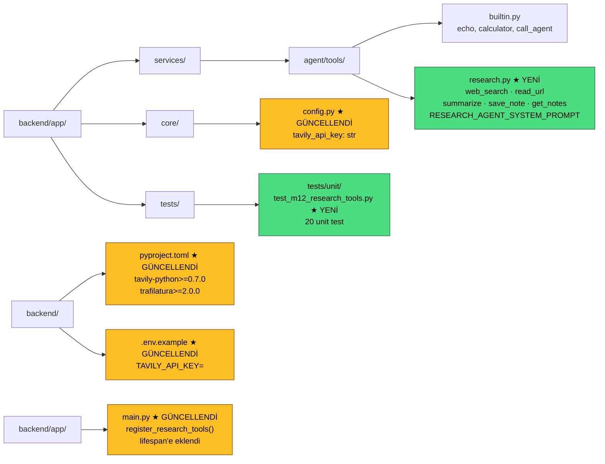
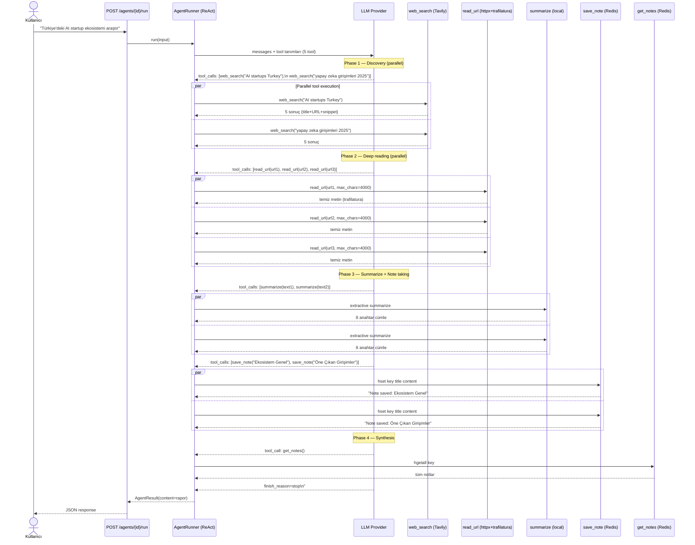
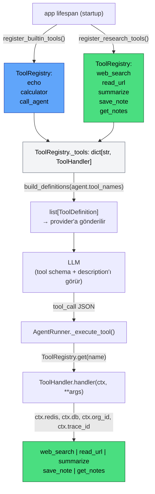
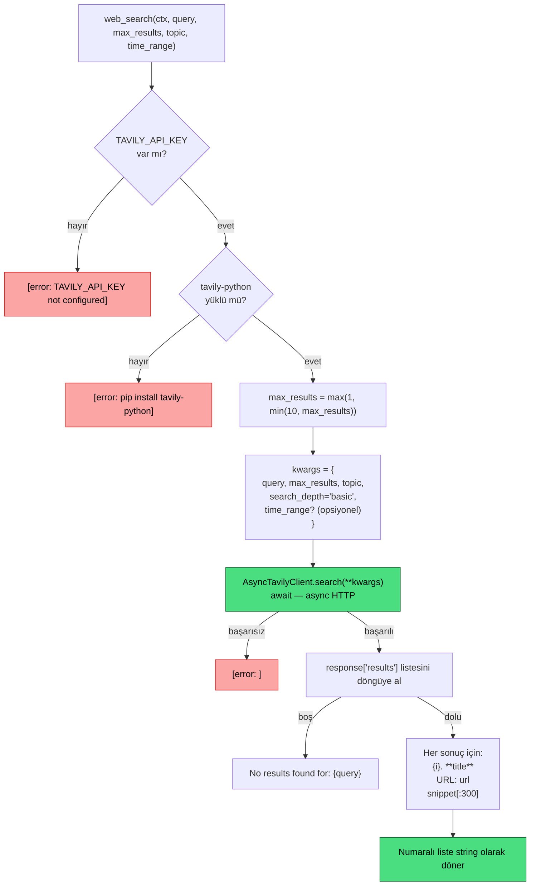
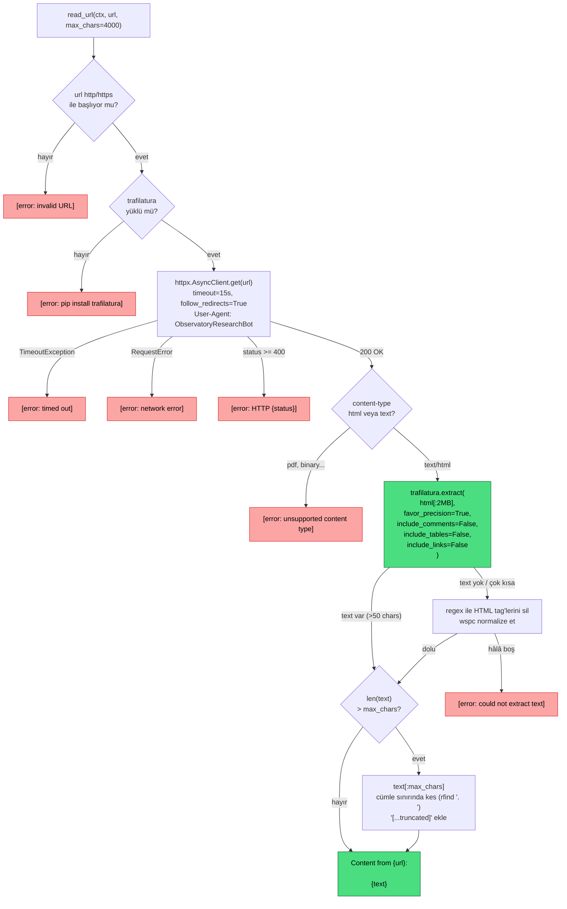
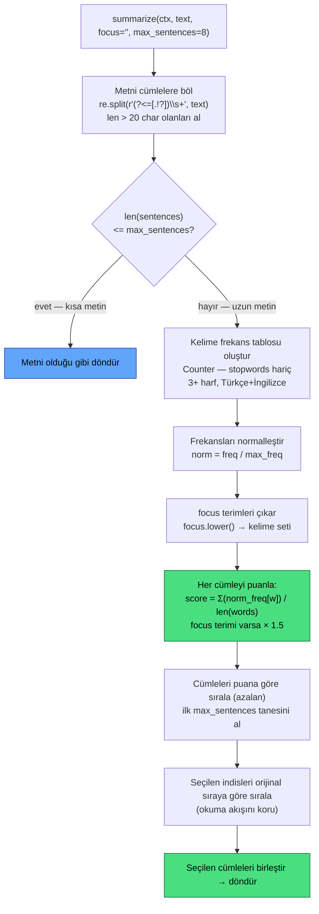
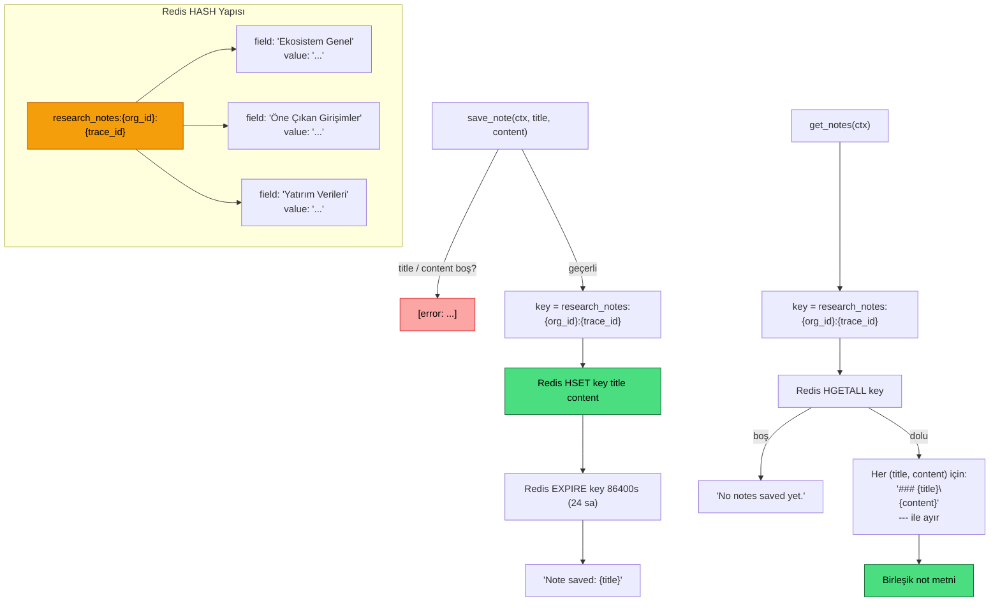
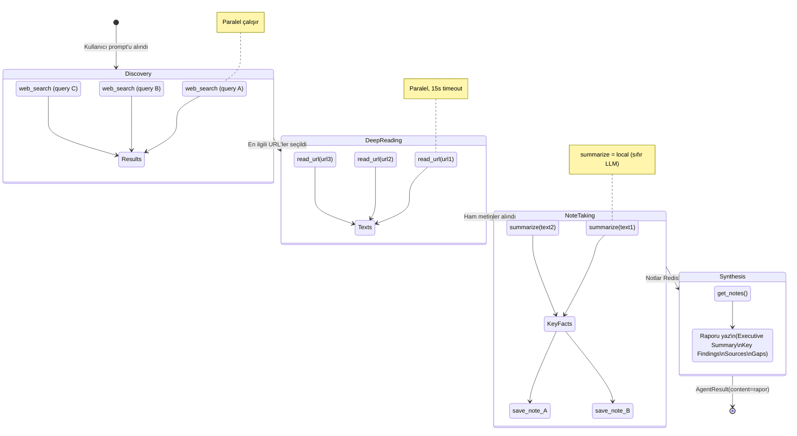
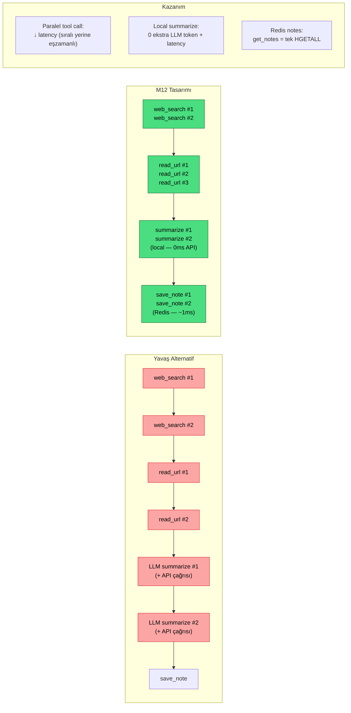
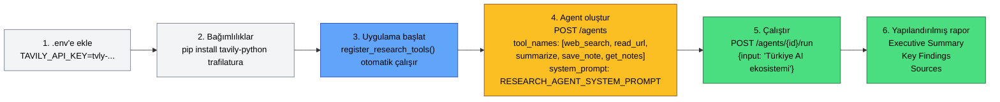

# M12 Diyagramları — Personal Research Agent

## 1. M12 Dosya Yapısı

---

## 2. Research Agent Tam Akışı (ReAct + Paralel Tool Kullanımı)

---

## 3. Tool Mimarisi — Kayıt ve Çalışma Zamanı

---

## 4. web_search — Tavily İç Akışı

---

## 5. read_url — httpx + trafilatura Pipeline

---

## 6. summarize — TF-Tabanlı Extractive Algoritma

---

## 7. save_note / get_notes — Redis Veri Modeli

---

## 8. Research Agent — 4 Fazlı Çalışma Modeli

---

## 9. Hız Optimizasyonu — Neden Bu Tasarım?

---

## 10. Kurulum ve Kullanım

