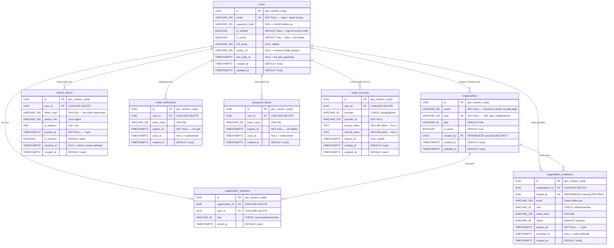
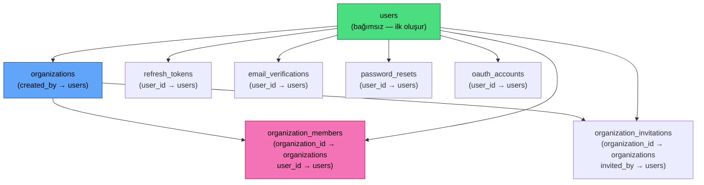
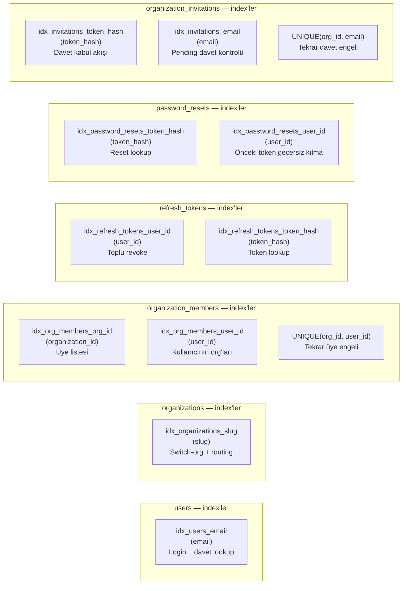
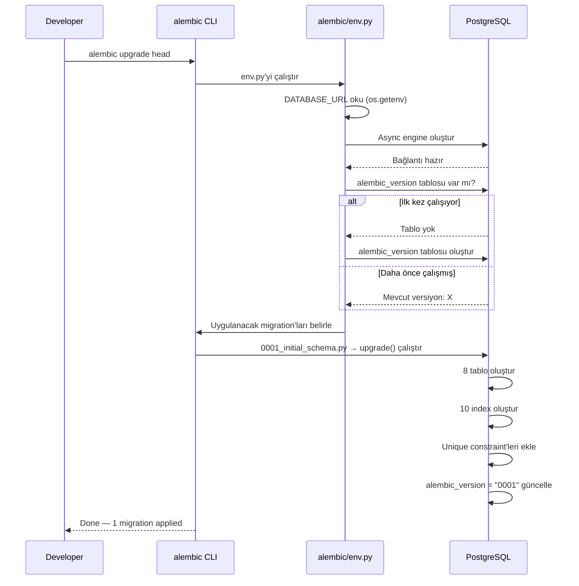
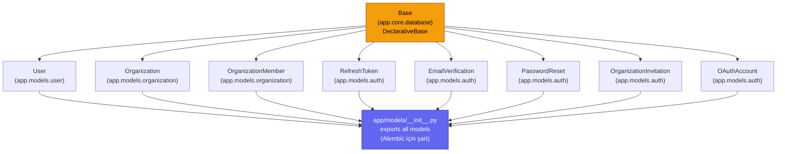
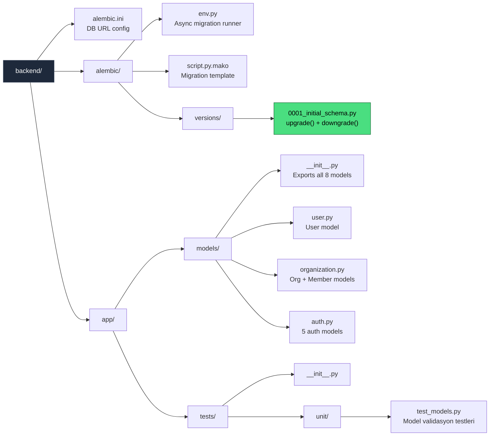

# M2 Diyagramları — DB Şeması + Migrations

## 1. ER Diyagramı (Tam)

---

## 2. Tablo Bağımlılık Grafiği (Migration Sırası)

---

## 3. Index ve Constraint Haritası

---

## 4. Alembic Migration Akışı

---

## 5. SQLAlchemy Model Hiyerarşisi

---

## 6. M2 Dosya Yapısı

