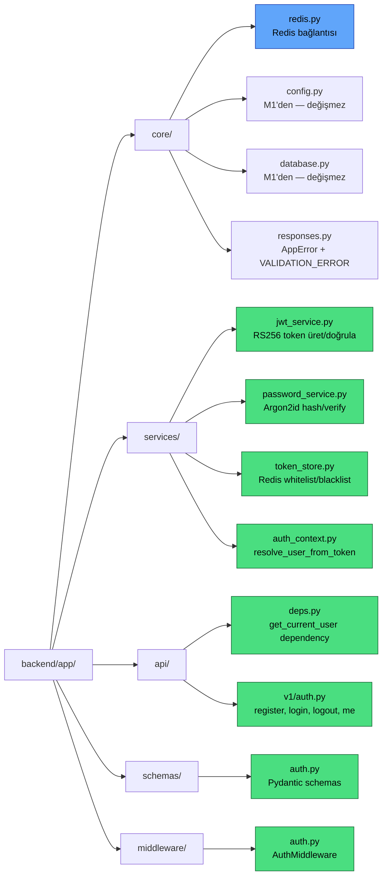
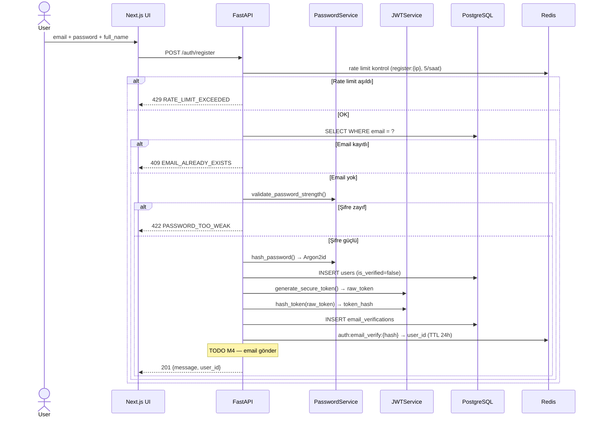
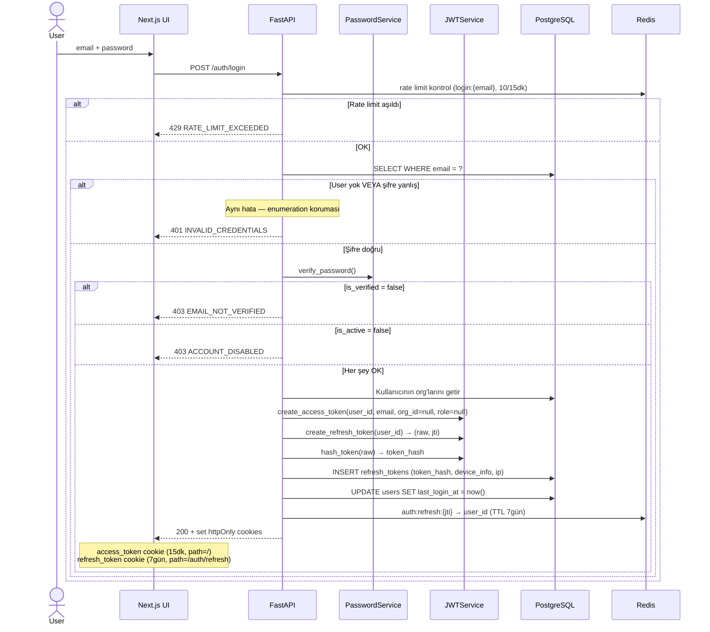
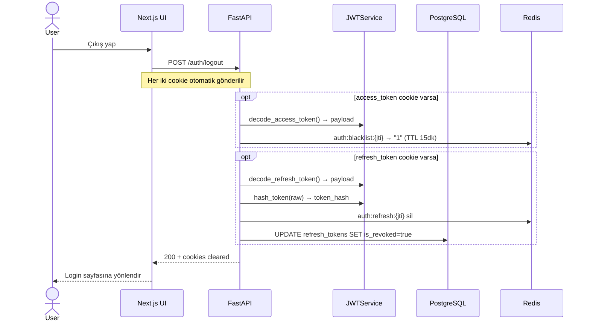
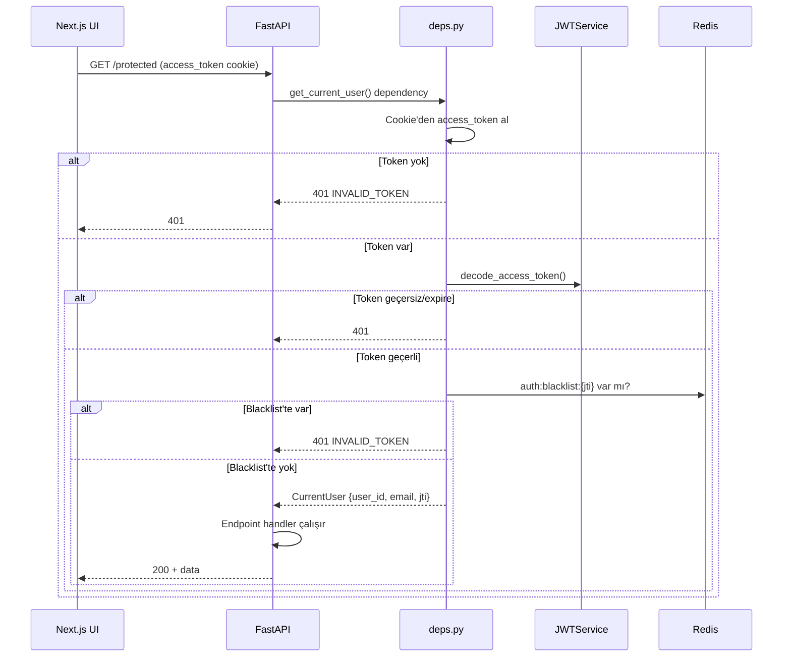
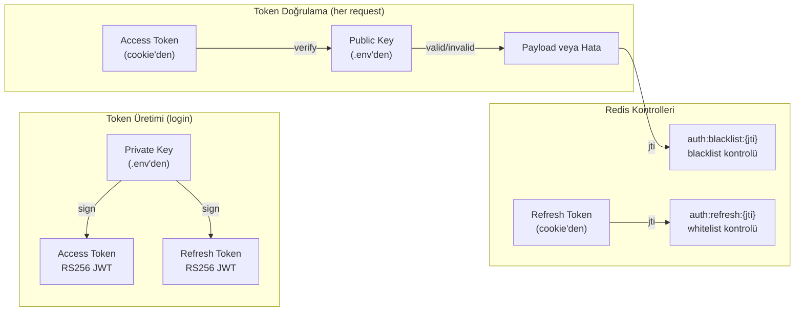
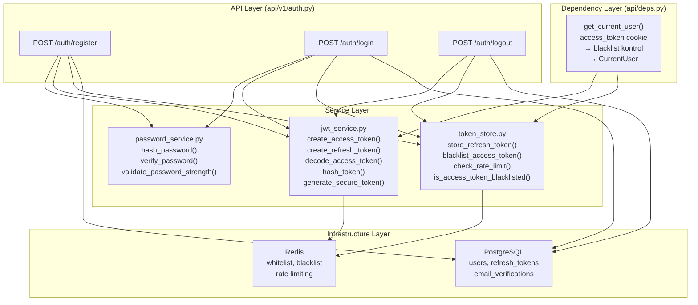

# M3 Diyagramları — Auth Faz 1: Core

## 1. M3 Dosya Yapısı

---

## 2. Register Akışı

---

## 3. Login Akışı

---

## 4. Logout Akışı

---

## 5. Protected Endpoint Akışı (get_current_user)

---

## 6. RS256 Token Akışı

---

## 7. Servis Katmanı Mimarisi

