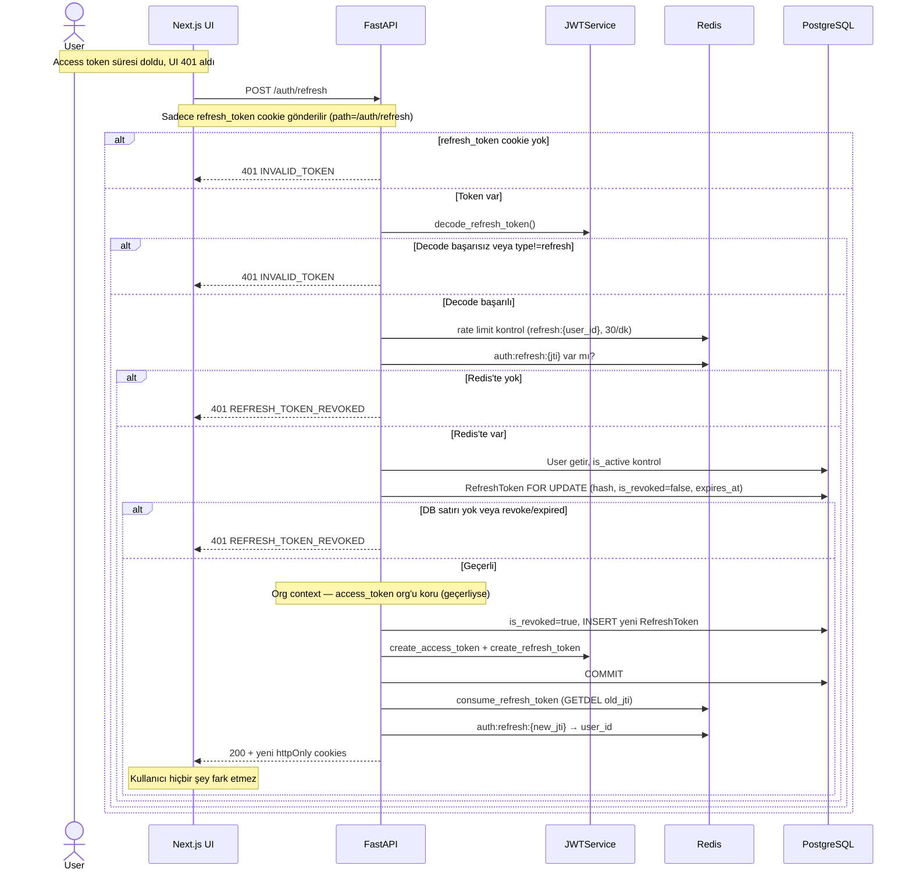
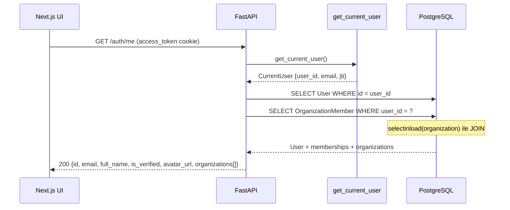
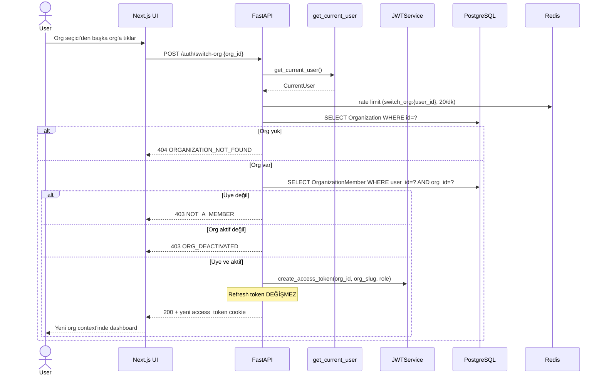
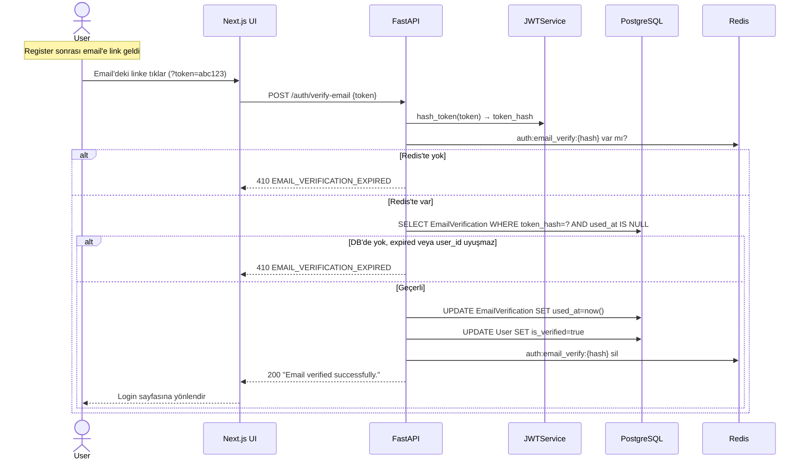
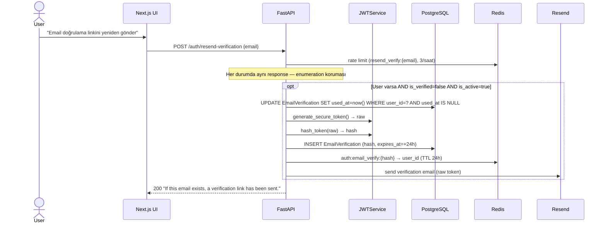
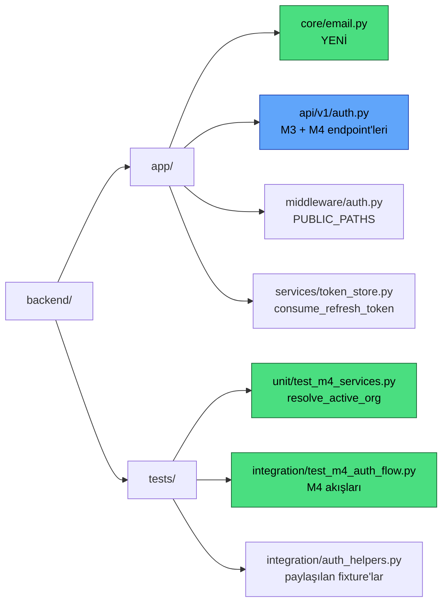

# M4 Diyagramları — Session Management

## 1. Token Refresh + Rotation Akışı

---

## 2. GET /auth/me Akışı

---

## 3. Switch-Org Akışı

---

## 4. Email Verification Akışı

---

## 5. Resend Verification Akışı

---

## 6. M4 Dosya Yapısı

