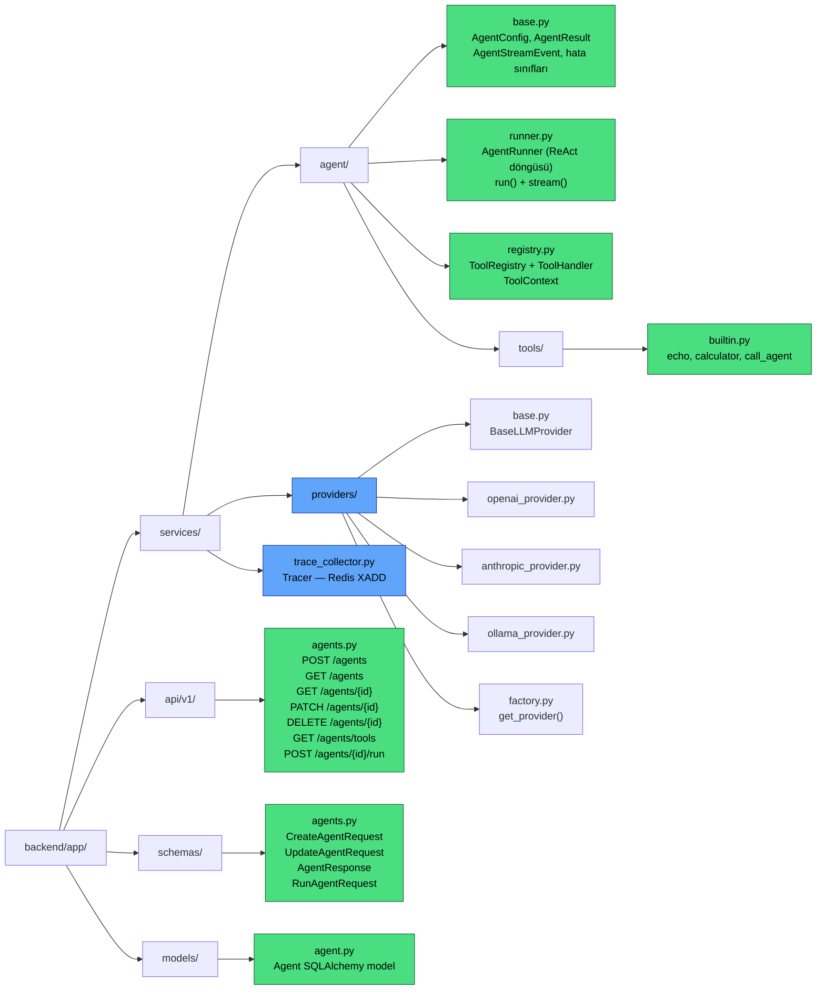
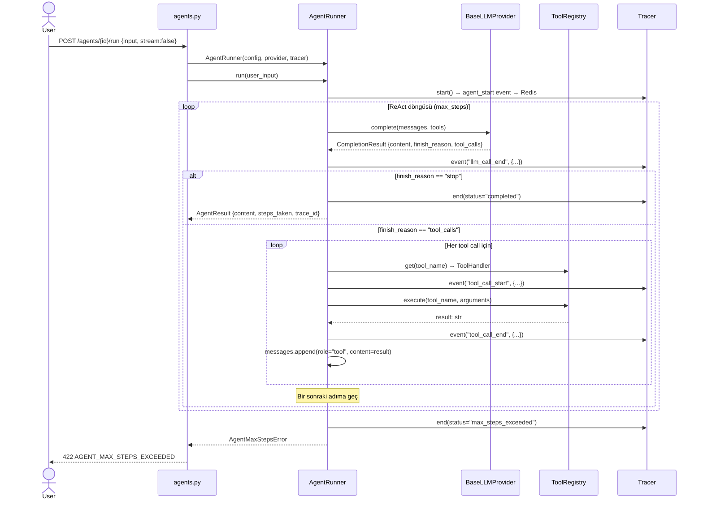
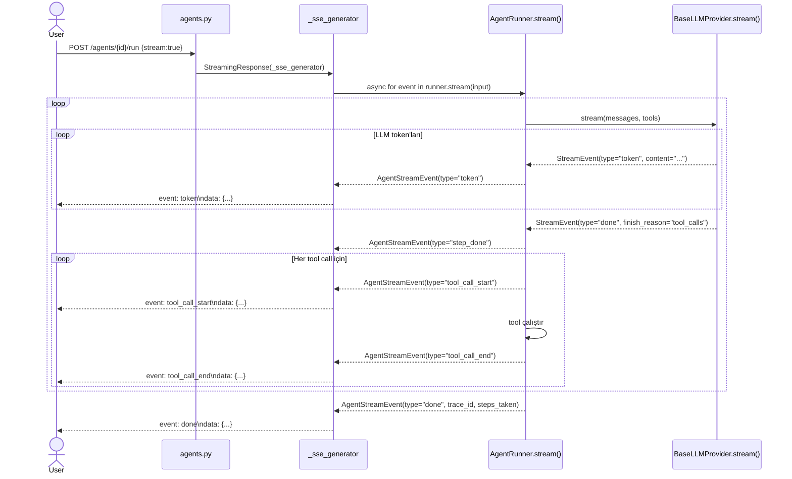
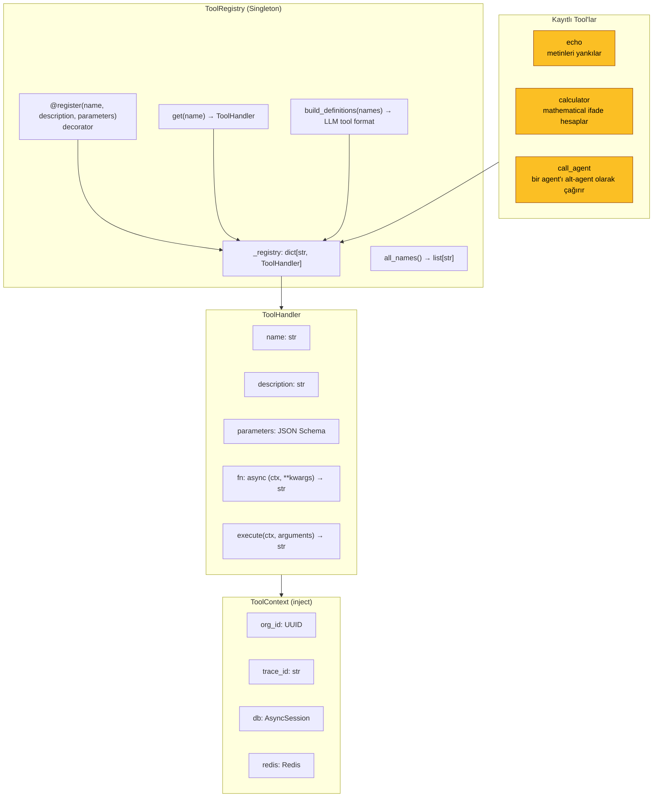
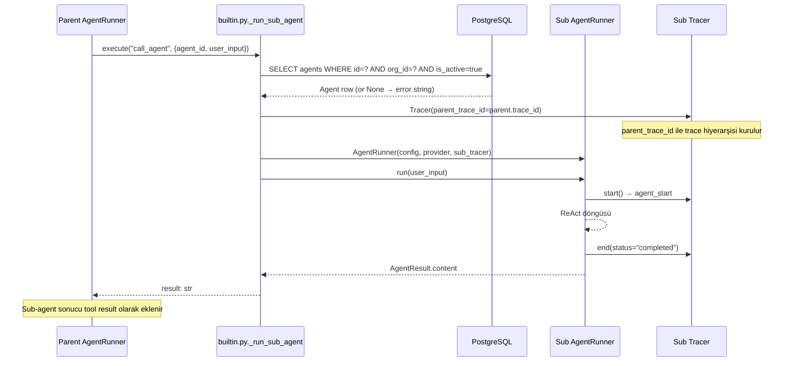
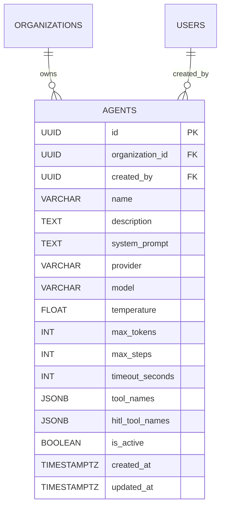
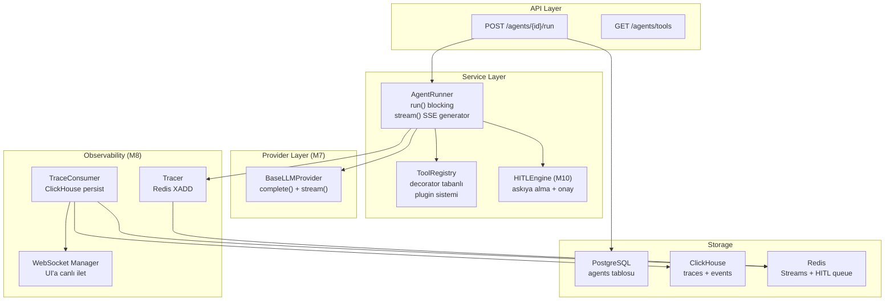
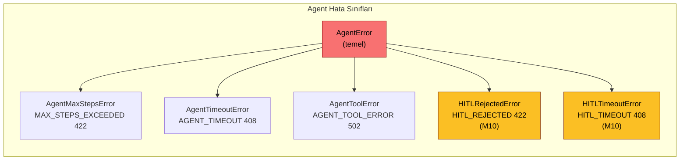
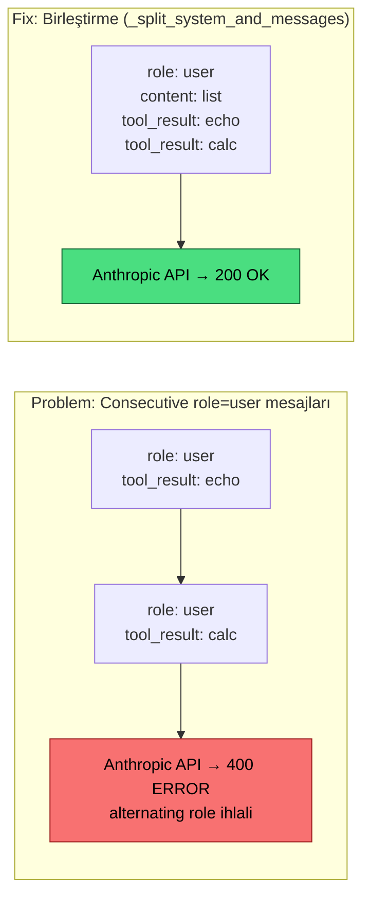

# M9 Diyagramları — Agent Engine

## 1. M9 Dosya Yapısı

---

## 2. ReAct Execution Loop (run — blocking path)

---

## 3. Stream Path (SSE)

---

## 4. Tool Registry Mimarisi

---

## 5. Multi-Agent (call_agent) Akışı

---

## 6. Agent Model + Migration

---

## 7. Katmanlı Mimari (M9 genişlemesi)

---

## 8. Hata Kodları

---

## 9. Anthropic Multi-Tool Bug Fix

